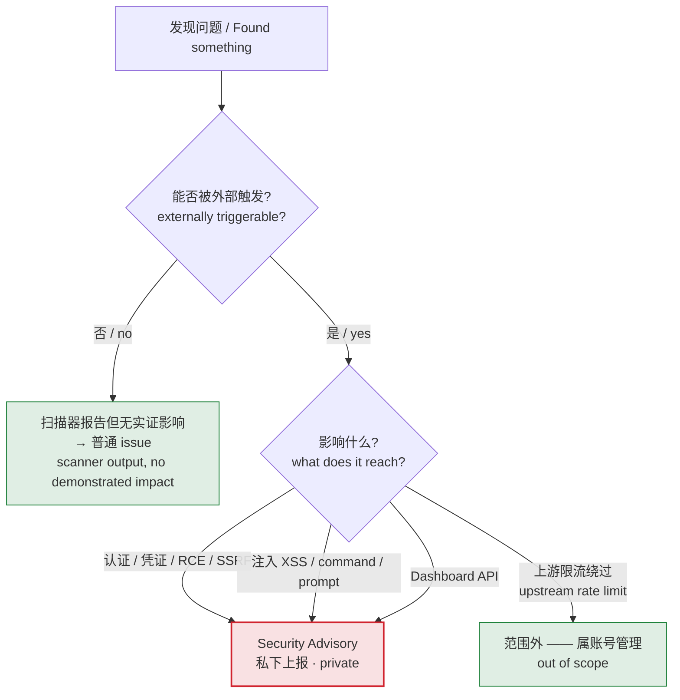

# Security Policy / 安全漏洞披露

  
  

> **TL;DR** — 别开 public issue。用
> [Security Advisory](https://github.com/dwgx/WindsurfAPI/security/advisories/new)（推荐）
> 或邮件 `dwgx1337@gmail.com`，标题前缀 `[WindsurfAPI Security]`。72 小时内回复。
>
> **Do not open a public issue.** Use a Security Advisory (preferred) or the email above.

## English

If you discover a security vulnerability in WindsurfAPI, **please do not open a public GitHub issue**.

Public issues are indexed by search engines and watched by forks — disclosing there exposes every deployed instance before a fix lands.

Instead, report privately via one of:

- GitHub Security Advisories: <https://github.com/dwgx/WindsurfAPI/security/advisories/new> (preferred — encrypted, tracks the fix)
- Email: `dwgx1337@gmail.com` with subject prefix `[WindsurfAPI Security]`

Please include:

- A description of the vulnerability and its impact
- Steps to reproduce (PoC appreciated)
- Affected version / commit SHA (check `/health` endpoint)
- Your contact for follow-up

You can expect a first response within **72 hours**. Valid reports will be credited in the release notes (unless you prefer anonymity).

### In scope
- Authentication bypass (dashboard, account pool)
- Account/token/credential leakage
- Remote code execution, SSRF, path traversal
- Injection attacks (XSS, command, prompt)
- Dashboard API vulnerabilities

### Out of scope
- Rate-limit bypass on upstream Windsurf (that's an account-management concern, not a vuln in this proxy)
- Issues requiring physical access to the host
- Findings from automated scanners without demonstrated impact

---

## 简体中文

发现安全漏洞请**不要开 public issue**。public issue 会被搜索引擎索引、被所有 fork 关注 —— 漏洞一旦公开，所有已部署的实例在补丁落地前都会暴露。

请用下面任一方式私下报告：

- GitHub Security Advisories（推荐，加密、跟进修复）：<https://github.com/dwgx/WindsurfAPI/security/advisories/new>
- 邮件：`dwgx1337@gmail.com`，标题前缀 `[WindsurfAPI Security]`

请附上：

- 漏洞描述 + 影响范围
- 复现步骤（有 PoC 最好）
- 受影响的版本 / commit SHA（看 `/health` 端点）
- 方便联系的方式

一般 **72 小时内**会首次回复。有效报告会在 release notes 里致谢（除非你要求匿名）。
